# Markov Decision Process and Bellman Optimality --- Seminar Notes

## Recommended seminar flow

**Central narrative**

> Environment produces states and rewards → agent chooses actions using
> a policy → rewards accumulate into return → value functions estimate
> long-term return → Bellman equations express value recursively →
> optimization gives the optimal policy.

------------------------------------------------------------------------

## 1. Markov Decision Process --- Agent and Environment


### What to explain

Start with the interaction loop. The environment provides the current
state and reward information; the agent chooses an action, and that
action affects what happens next.

### Seminar emphasis

Key point: reinforcement learning is fundamentally a sequential
interaction between an agent and an environment.

## 2. Formal Definition of an MDP: (S, A, R, P)

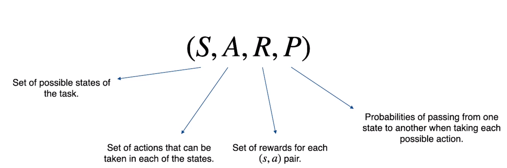

### What to explain

Introduce the four components. S is the set of possible states, A is the
set of possible actions, R represents rewards, and P describes the
transition probabilities between states when actions are taken.

### Seminar emphasis

This slide gives the mathematical structure of the environment in which
the agent operates.

## 3. The Markov Property

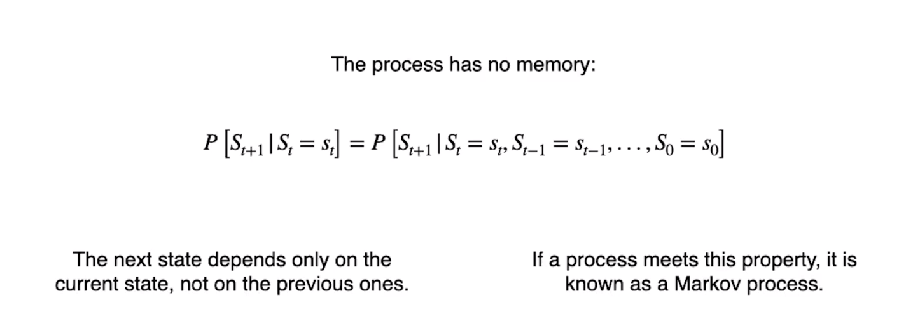

### What to explain

Explain that the next state depends on the current state rather than the
complete history. Formally, the conditional distribution of S(t+1) given
S(t) is unchanged when earlier states are also known.

### Seminar emphasis

The Markov assumption is what allows the current state to summarize the
information needed for predicting the future.

## 4. Markov Chain vs Markov Decision Process

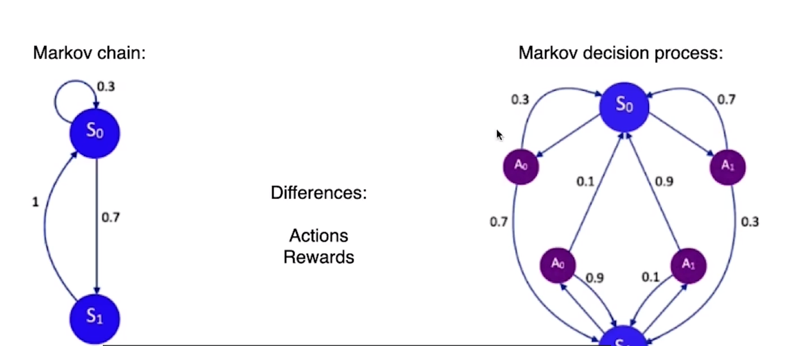

### What to explain

A Markov chain has state-to-state transitions, but no agent-controlled
action or reward objective. An MDP adds actions and rewards, allowing an
agent to make decisions.

### Seminar emphasis

Use this slide to make the transition from probability-based state
evolution to decision making.

## 5. Trajectory

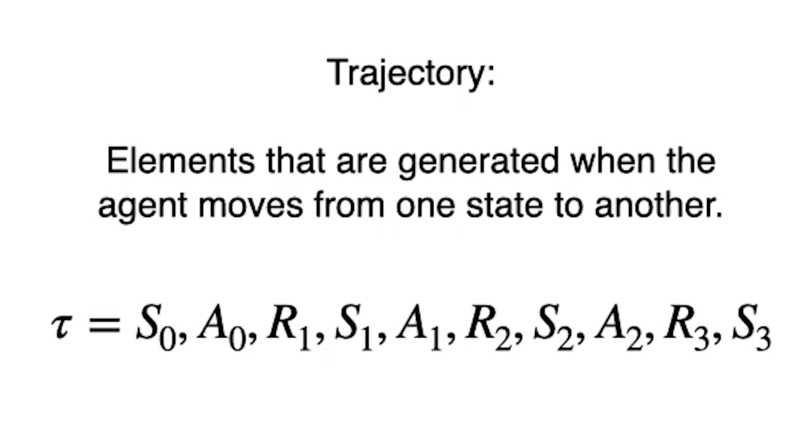

### What to explain

A trajectory is the sequence of states, actions, and rewards generated
during interaction. A typical sequence is S0, A0, R1, S1, A1, R2, S2,
...

### Seminar emphasis

Emphasize that a trajectory is one realized path through the MDP.

## 6. Episode

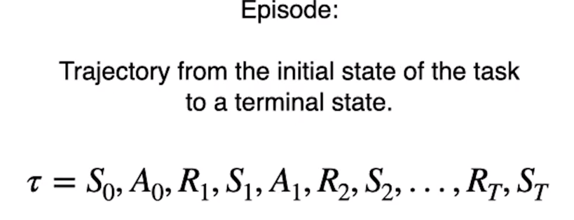

### What to explain

An episode is a trajectory that starts at an initial state and ends at a
terminal state. The terminal state marks the end of that particular task
instance.

### Seminar emphasis

Distinguish the general idea of a trajectory from a complete episode.

## 7. Reward

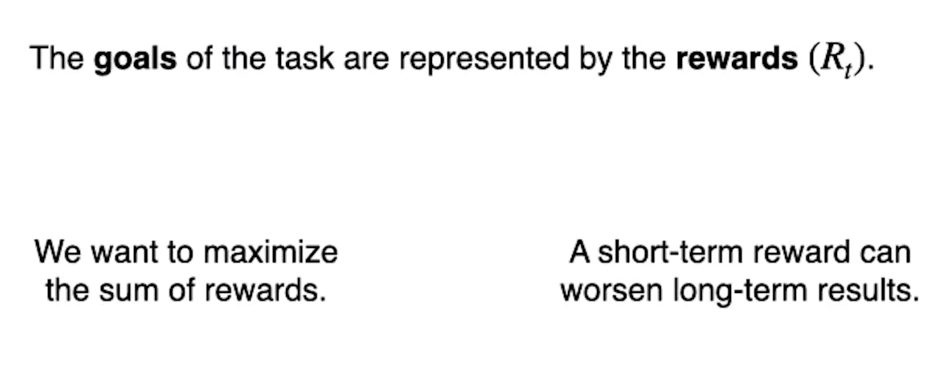

### What to explain

Reward is the immediate numerical feedback produced by the environment.
It encodes what the task wants the agent to achieve.

### Seminar emphasis

The reward is immediate; it is not the same thing as long-term
performance.

## 8. Return

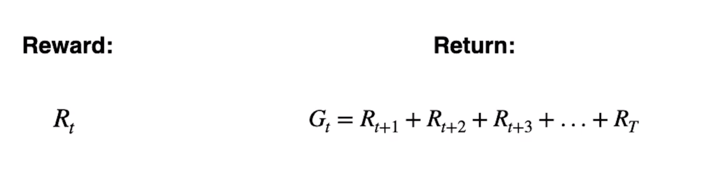

### What to explain

Return is the cumulative future reward from a particular time step.
Without discounting, G_t is the sum of future rewards until the end of
the episode.

### Seminar emphasis

This is the quantity the agent ultimately wants to maximize.

## 9. Discount Factor γ

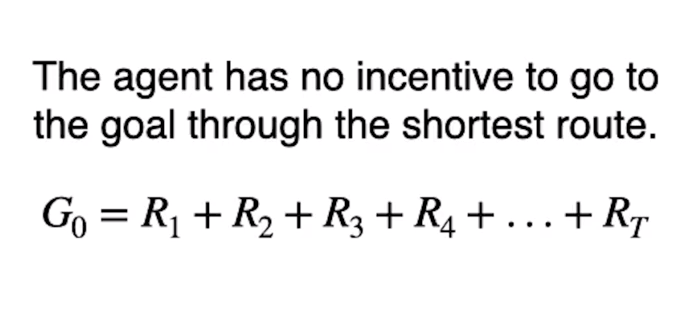

### What to explain

Introduce discounting so that rewards farther in the future contribute
less to the current return. The discounted return is G_t = R(t+1) +
γR(t+2) + γ²R(t+3) + ...

### Seminar emphasis

γ is between 0 and 1. Smaller values emphasize short-term rewards;
values close to 1 place more weight on long-term rewards.

## 10. Policy π(s)

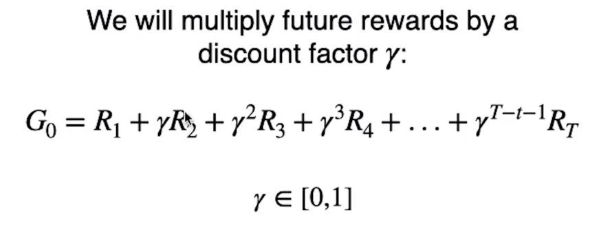

### What to explain

A policy defines how the agent chooses actions from states. In the
simplest deterministic form, π maps a state to an action.

### Seminar emphasis

The policy is the agent's decision-making rule.

## 11. Deterministic vs Stochastic Policy

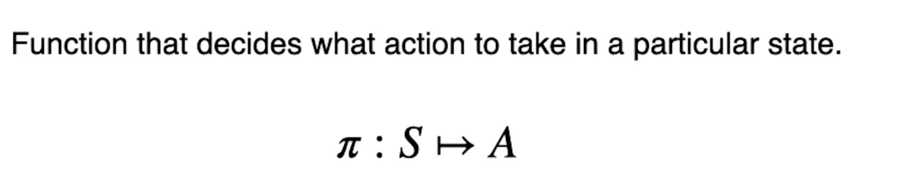

### What to explain

A deterministic policy selects one action for a state. A stochastic
policy assigns probabilities to possible actions, represented by
π(a\|s).

### Seminar emphasis

For a stochastic policy, the probabilities over all available actions
must sum to 1.

## 12. State-Value Function vπ(s)

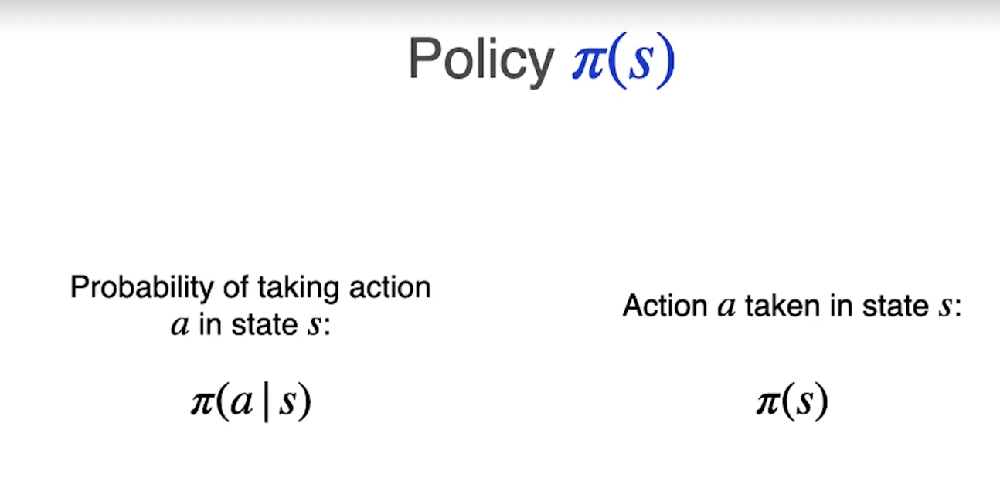

### What to explain

The state-value function is the expected return starting from state s
while following policy π: vπ(s) = Eπ\[G_t \| S_t = s\].

### Seminar emphasis

Interpret vπ(s) as: 'How valuable is it to be in this state if I
continue following this policy?'

## 13. Action-Value Function qπ(s,a)

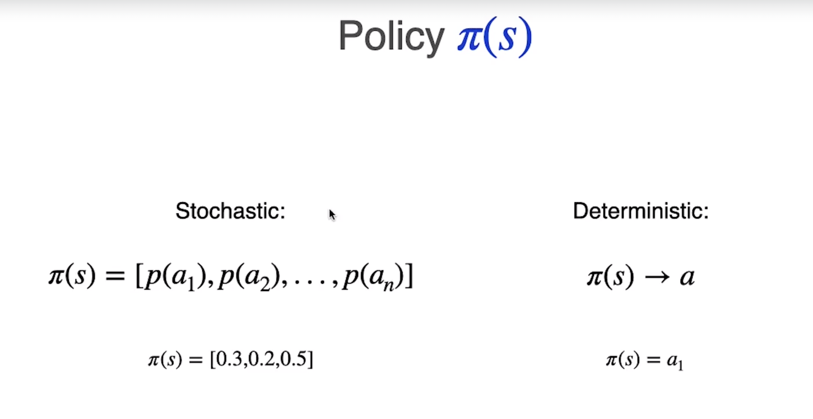

### What to explain

The action-value function is the expected return when the agent is in
state s, takes action a, and then follows policy π: qπ(s,a) = Eπ\[G_t \|
S_t=s, A_t=a\].

### Seminar emphasis

The distinction is important: v evaluates a state, while q evaluates a
state-action pair.

## 14. Bellman Equation for vπ(s)

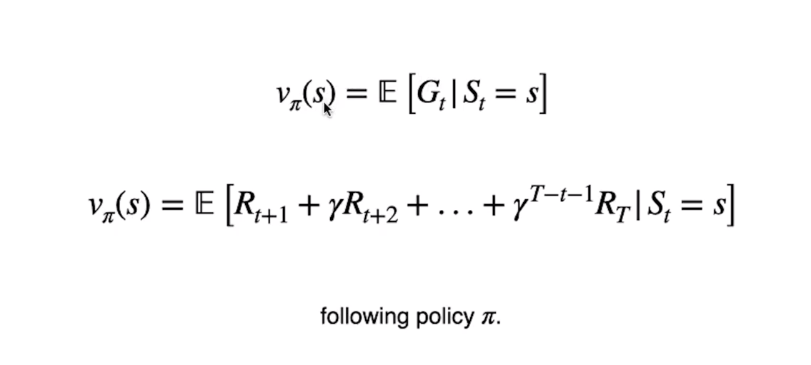

### What to explain

Start by decomposing the return: G_t = R(t+1) + γG(t+1). Taking the
expectation gives the recursive Bellman equation for the state-value
function.

### Seminar emphasis

The Bellman equation expresses the value of the current state in terms
of immediate reward plus discounted value of the next state.

## 15. Bellman Equation for qπ(s,a)

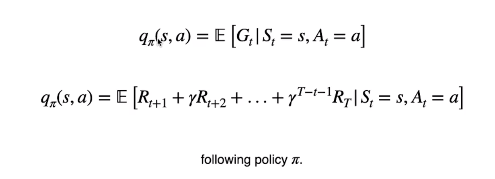

### What to explain

For qπ(s,a), the first action is fixed as a. After the transition to s',
the agent follows policy π, so the future value is obtained by averaging
over the possible next actions.

### Seminar emphasis

This equation recursively evaluates a particular action and then the
policy-controlled future.

## 16. Optimal Value and Optimal Policy

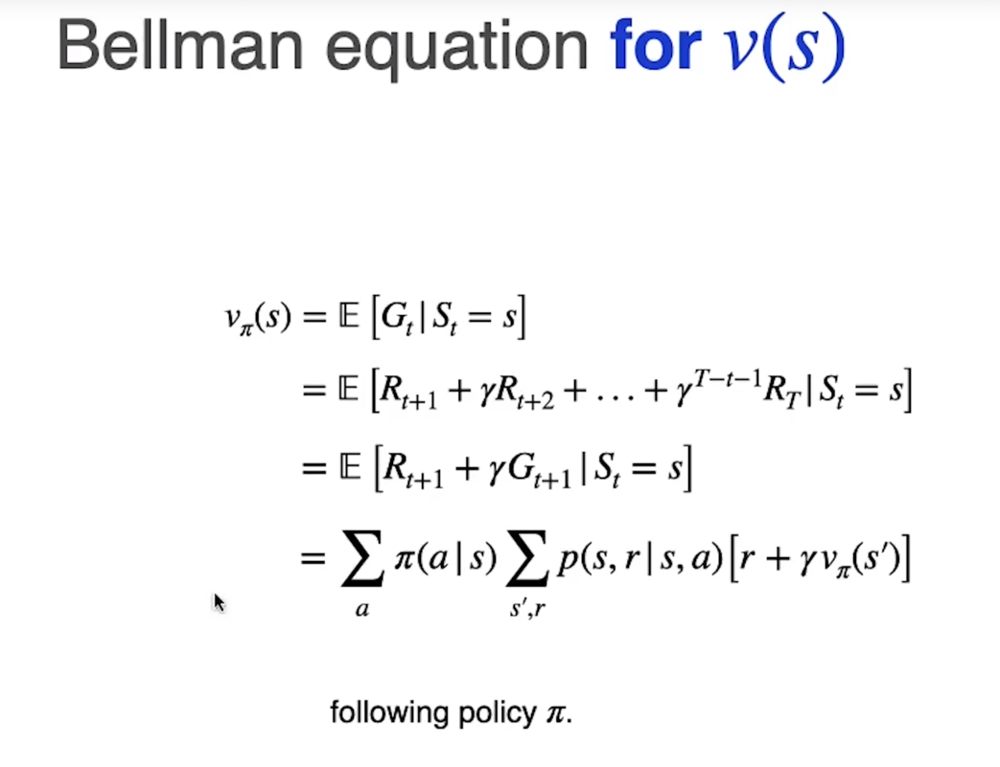

### What to explain

Define the optimal value functions as the highest achievable expected
returns. The optimal policy chooses actions that maximize the value or
action-value function.

### Seminar emphasis

The goal is no longer to evaluate an arbitrary policy; it is to identify
behavior that maximizes expected return.

## 17. The Circular Dependency

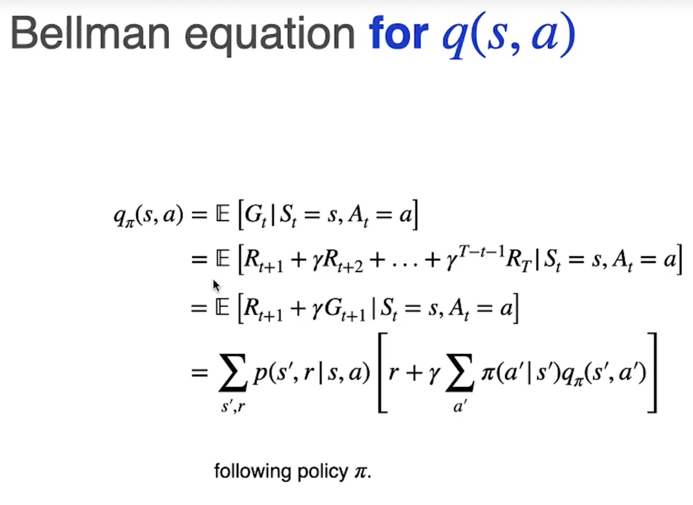

### What to explain

There is an apparent circular dependency: to determine the optimal
policy we need optimal values, but to determine optimal values we need
the optimal policy.

### Seminar emphasis

This motivates the Bellman optimality equations, which remove the
explicit dependence on a previously known policy by taking a maximum
over actions.

## 18. Bellman Optimality Equations

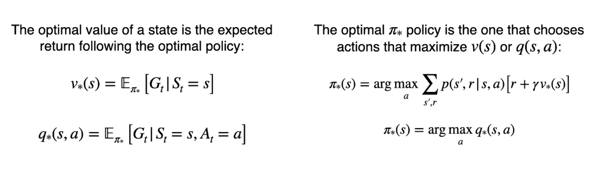

### What to explain

The optimal Bellman equations directly express the optimal value
recursively. For v*(s), choose the action with the highest expected
immediate reward plus discounted future optimal value. For q*(s,a), the
future action is selected using max over a'.

### Seminar emphasis

This is the logical endpoint of the seminar: MDP → policy → value →
Bellman equation → optimization → Bellman optimality.

------------------------------------------------------------------------

# Conceptual Flow

``` text
                    REINFORCEMENT LEARNING
                             |
                             v
                  Markov Decision Process
                             |
                    +--------+--------+
                    |                 |
                    v                 v
                  States           Actions
                    |                 |
                    +--------+--------+
                             |
                             v
                           Reward
                             |
                             v
                           Return
                             |
                       Discount γ
                             |
                             v
                           Policy
                             |
                    +--------+--------+
                    |                 |
                    v                 v
              State Value        Action Value
                 vπ(s)              qπ(s,a)
                    |                 |
                    +--------+--------+
                             |
                             v
                    Bellman Equations
                             |
                             v
                         Optimization
                             |
                             v
                    Optimal Policy π*
                             |
                             v
               Bellman Optimality Equation
```

# Important distinctions to state clearly

### Reward vs Return

-   **Reward**: immediate feedback, R_t.
-   **Return**: cumulative discounted future reward, G_t.

### State value vs Action value

-   **vπ(s)**: expected return from state s under policy π.
-   **qπ(s,a)**: expected return from state s after taking action a and
    then following π.

### Bellman equation vs Bellman optimality equation

-   **Bellman equation**: evaluates a particular policy π.
-   **Bellman optimality equation**: directly describes the best
    achievable value by maximizing over actions.

# Core equations

### Return

\[ G_t = R\_{t+1} + `\gamma `{=tex}R\_{t+2} + `\gamma`{=tex}\^2
R\_{t+3} + `\cdots`{=tex} \]

### Policy

\[ `\pi`{=tex}(a\|s) = P(A_t=a `\mid `{=tex}S_t=s) \]

### State-value function

\[ v\_`\pi`{=tex}(s)=`\mathbb{E}`{=tex}\_`\pi[G_t\mid S_t=s]`{=tex}\]

### Action-value function

\[
q\_`\pi`{=tex}(s,a)=`\mathbb{E}`{=tex}\_`\pi[G_t\mid S_t=s,A_t=a]`{=tex}\]

### Bellman equation for state value

\[ v\_`\pi`{=tex}(s) = `\sum`{=tex}*a `\pi`{=tex}(a\|s)
`\sum`{=tex}*{s',r} p(s',r\|s,a) `\left[r+\gamma v_\pi(s')ight]`{=tex}\]

### Bellman equation for action value

\[ q\_`\pi`{=tex}(s,a) = `\sum`{=tex}\_{s',r}p(s',r\|s,a) `\left[
r+\gamma
\sum_{a'}\pi(a'|s')q_\pi(s',a')
ight]`{=tex}\]

### Bellman optimality equation for state value

\[ v\_\*(s) = `\max`{=tex}*a `\sum`{=tex}*{s',r} p(s',r\|s,a)
`\left[r+\gamma v_*(s')ight]`{=tex}\]

### Bellman optimality equation for action value

\[ q\_\*(s,a) = `\sum`{=tex}\_{s',r}p(s',r\|s,a) `\left[
r+\gamma\max_{a'}q_*(s',a')
ight]`{=tex}\]

### Optimal policy

\[ `\pi`{=tex}\_*(s)=rg`\max`{=tex}*a q**(s,a) \]

------------------------------------------------------------------------

# Suggested speaking sequence

1.  Start with the agent-environment interaction.
2.  Define the MDP formally as `(S, A, R, P)`.
3.  Explain the Markov property.
4.  Contrast an MDP with a Markov chain.
5.  Explain trajectories and episodes.
6.  Introduce reward.
7.  Build reward into return.
8.  Explain why discount factor γ is introduced.
9.  Define policy.
10. Explain deterministic and stochastic policies.
11. Define state-value function.
12. Define action-value function.
13. Derive the Bellman equation for vπ(s).
14. Derive the Bellman equation for qπ(s,a).
15. Introduce the optimal value functions and optimal policy.
16. Explain the policy/value circular dependency.
17. Resolve it with Bellman optimality equations.
18. End by connecting the complete chain from MDP to optimal policy.

## One-sentence conclusion

> **Bellman optimality equations provide a recursive way to express the
> maximum long-term expected return by combining immediate reward with
> the optimal value of future states or actions.**
